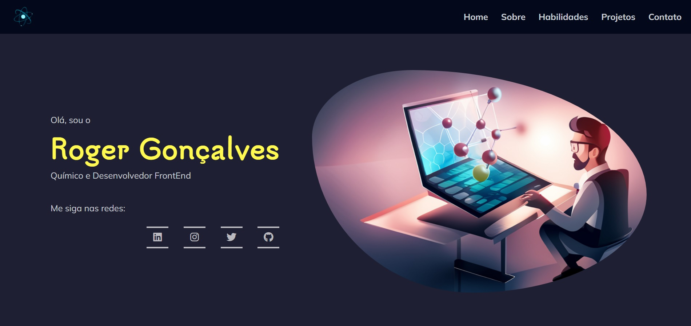
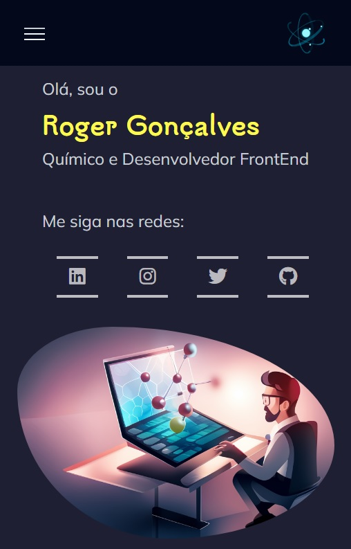

# Personal Portfolio

My personal portfolio, made from scratch, contains several elements that I learned to improve, in a harmonious and well-articulated way. However, this is still the first version and some other features will be added:

- [x] Responsiveness using minimal media query
- [ ] Light/Dark theme switching
- [ ] Portuguese/English language selection

_____

## Table of contents

- [Overview](#overview)
	- [Screenshot](#screenshot)
	- [Links](#links)
	- [Built with](#built-with)
- [Author](#author)

## Overview
### Screenshot

 

### Links
- Live Site URL: [Github Pages](https://gabirueitz.github.io/portfolio/)

### Built with
- Semantic HTML5 markup
- CSS custom properties
- Flexbox
- Grid
- JavaScript

## Contact Me:
    